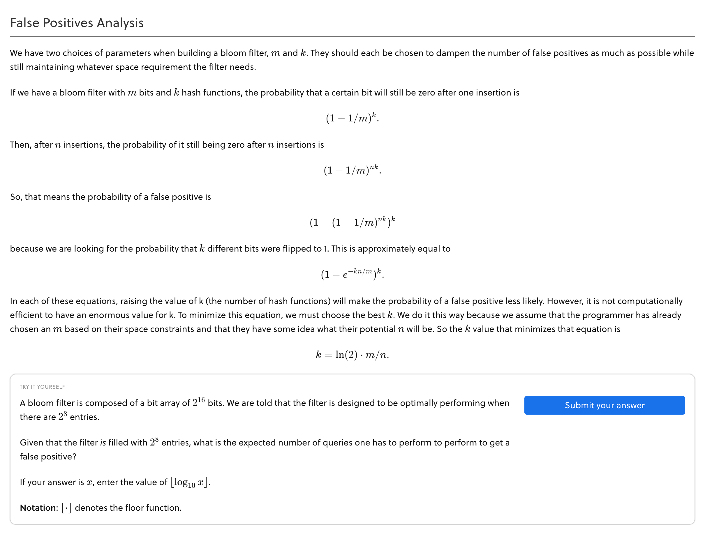

# Bloom filter analysis

  


Run with

```
deno run https://raw.githubusercontent.com/zxch3n/bloom-filter/master/solve.ts
```

Example output
```
The bloom filter contains m bits and has capacity of n elements.
Enter m:  1000
Enter n:  100
The best k = 7
False positive rate = 0.008213554634050255
```
